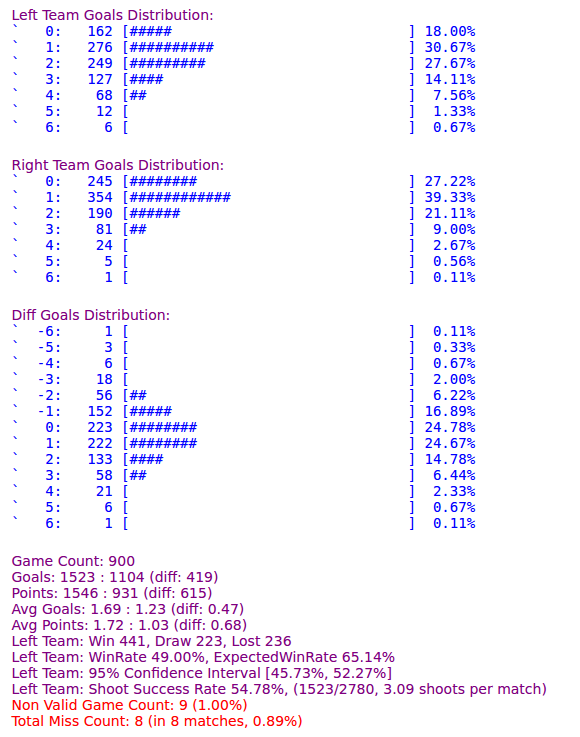
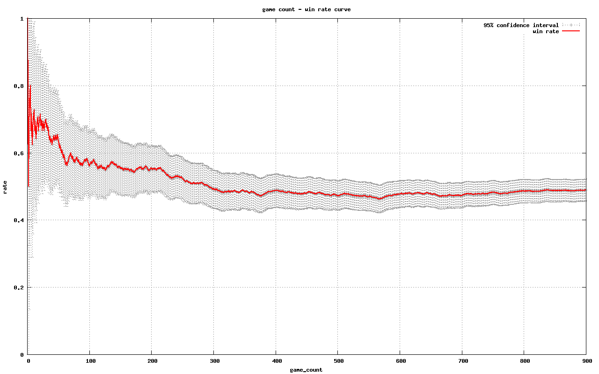
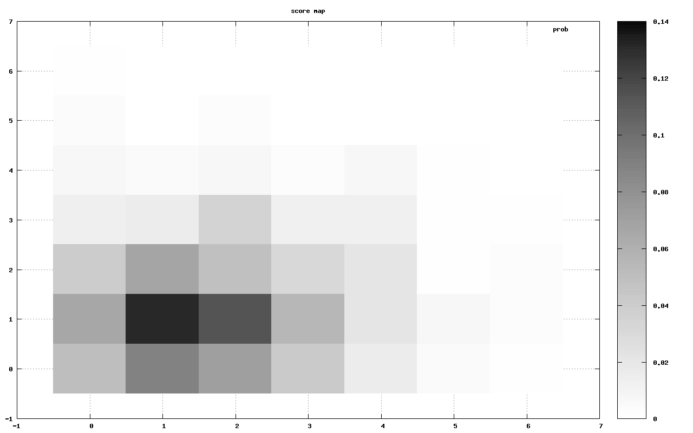

# autotest2d
Auto test scripts for RoboCup soccer simulation 2d games 

## Prequisites
except python3 nothing. :)

## How to RUN
you should edit your left team and right team directory for binaries of teams in the start_left and start_right files.

``` bash
test.sh start_left start_right
```

also you can see the results until now while the test.sh script is running by executing the following command.

``` bash
result.sh
```

## How to Terminate
to kill the processes and open up the results for new and other simulations, please execute the following command.

``` bash
kill.sh
```

## Usages
* Configure `PROCES` in `test.sh` as the number of simultaneously running rcssservers (each rcssserver will run in a different port automatically)
* Configure `CLIENTS` in `test.sh` to be the list of client machines running teams
* Make sure you can login to `CLIENTS` using `ssh` without typing password from the machine (which is a server) you run `test.sh`
* Deploy the testing teams (left and right) to `CLIENTS`, for example, using `scp`
* Configure `start_left` and `start_right` scripts to start left and right teams
* Run `test.sh` from the central server to start the auto test
* Use in combination with [lanmonitor](https://github.com/wrighteagle2d/lanmonitor) to monitor the testing status

## Files
* test.sh -- run auto test
* kill.sh -- stop test
* result.sh -- show result
* analyze.sh -- show more information
* start\_left -- script to start left team
* start\_right -- script to start right team
* start.tmpl -- templates of start scripts
* scripts/automonitor -- start monitors

## Example outputs:
- Output:  


- Game Curve:  


- Score Map:  


